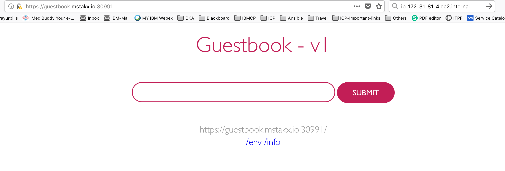

# K8s-mStakx-K8s-Level2-Test
1.	Create a Highly available Kubernetes cluster manually using Google Compute Engines (GCE). Do not create a Kubernetes hosted solution using Google Kubernetes Engine (GKE). Use Kubeadm(preferred)/kubespray. Do not use kops.

Solution:
I have setup the Highly Available clusters with kubeadm. [Install K8s Cluster](https://github.com/senthil2kumars/K8s-mStakx-Level2-Test/tree/master/k8s-install-Prerequisites)


2.	Create a CI/CD pipeline using Jenkins (or a CI tool of your choice) outside Kubernetes cluster (not as a pod inside Kubernetes cluster).

Solution: I have setup Jenkins server on AWS-Ubuntu 16.04
 The Jenkins dashboard :


3.	Create a development namespace.

Solution:
```
    Created Development namespace:
    $root@ip-172-31-87-214:~# kubectl get namespace development
    NAME          STATUS   AGE
    development   Active   6s
```

4.	Deploy guest-book application (or any other application which you think is more suitable to showcase your ability, kindly justify why you have chosen a different application) in the development namespace.

Solution: Choosen Guest-book application.

5.	Install and configure Helm in Kubernetes

Solution: Configured Helm.
```
    $root@ip-172-31-87-214:~# helm repo list
    NAME  	URL                                             
    stable	https://kubernetes-charts.storage.googleapis.com
    local 	http://127.0.0.1:8879/charts                    
```
6.	Use Helm to deploy the application on Kubernetes Cluster from CI server.

Solution:
I have created CI/CD pipeline(Using Freestyle Projec) for Image build & Guestbook applicaton deployment on k8s cluster using helm chart

During the Build, Dockerfiles are pulled from the github and build the docker image , Once built has been completed, it will scan through "Anchore Container Image Scanner". Once scanning successful it will push to docker registry.

During the Deploy stage, It will pull the guestbook application chart from the gihub and deploy the application using the built docker image.

7.	Create a monitoring namespace in the cluster.

Solution: I have created Monitoring namespace
```
    root@ip-172-31-87-214:~# kubectl get ns monitoring
    NAME         STATUS   AGE
    monitoring   Active   7h59m
```
8.	Setup Prometheus (in monitoring namespace) for gathering host/container metrics along with health check status of the application.

Solution:
I have setup Prometheus using the helm chart. [Install Prometheus on k8s](https://github.com/senthil2kumars/K8s-mStakx-Level2-Test/tree/master/prometheus).


9.	Create a dashboard using Grafana to help visualize the Node/Container/API Server etc. metrices from Prometheus server. Optionally create a custom dashboard on Grafana.

Solution:
I have setup Grafana using the helm chart. [Install Grafana on k8s](https://github.com/senthil2kumars/K8s-mStakx-Level2-Test/tree/master/grafana) and imported custom dashboard using My-Dashboard-1563776879264.json file.


10.	Setup log analysis using Elasticsearch, Fluentd (or Filebeat), Kibana.

Solution:
I have setup EFK log analysis stack using the helm chart. [Install EFK on k8s](https://github.com/senthil2kumars/K8s-mStakx-Level2-Test/tree/master/elastic-stack)


11.	Demonstrate Blue/Green and Canary deployment for the application (For e.g. Change the background color or font in the new version etc.,)

Solution:
 Deployed application using helm chart through CI/CD pipeline.

 I have changed the font background clour change and tested.
 Through the Jenkins pipline, 

Before:


After:

